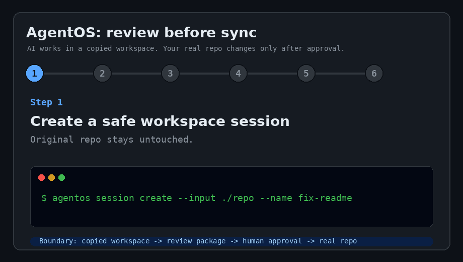

# AgentOS

[](https://github.com/shinyeonjun/AgentOS/actions/workflows/ci.yml)

AI coding agents should not touch your repo directly.

AgentOS runs them in persistent, disposable workspaces, then syncs only the changes you explicitly review and approve.

AgentOS is an approval-gated safe workspace runtime for external AI agents such as Codex CLI, Claude Code, Antigravity, Jarvis/OpenClaw, or any future worker that can operate on files.

```text
Workspace Session -> Tool Calls -> Artifacts -> Preview/Diff -> Approval -> Sync
```

The AI can keep working inside a copied project workspace. Your host project changes only after a human reviews the package and approves a sync scope.

Use AgentOS when you want AI coding help, but you still want a hard boundary between "the agent tried this" and "my real repo changed."



## Why This Exists

AI coding agents can edit files, run commands, generate artifacts, and produce convincing summaries. That is useful, but it also makes the boundary between "AI tried something" and "my real project changed" too easy to blur.

AgentOS makes that boundary explicit:

- copy inputs into an independent task workspace
- keep persistent workspace sessions for multi-command work
- record commands, outputs, diffs, and artifacts
- produce a review package for humans and tools
- block sync until an approval record exists
- run sync preflight before copying changes back
- sync only the approved paths or patch scope
- keep runtime state out of the source tree

AgentOS is not the AI brain. It is the safety, review, and sync layer around the brain.

## Current Status

AgentOS is an alpha runtime with a working local lifecycle. See [CHANGELOG.md](CHANGELOG.md) for release notes.

- deterministic demo agent for token-free smoke tests
- persistent workspace sessions
- Codex worker preparation and optional real execution
- local Codex plugin scaffold with bundled MCP launcher/runtime
- Docker-backed sandbox command runner
- JSON contracts for tasks, workers, review packages, approvals, and artifacts
- review rendering, diff rendering, integrity verification, approval, preflight, and sync
- Linux/WSL-focused scripts with native Windows checks improving over time

## Quick Start

Fastest no-token path:

```bash
python3 -m venv .venv
. .venv/bin/activate
python3 -m pip install -e .
agentos doctor --workspace "$PWD"
agentos demo
```

`agentos doctor` prints concrete next steps. When it passes, `agentos demo` runs a token-free review-before-sync flow that shows the core safety contract in one command.

Full sample lifecycle:

```bash
scripts/sample-e2e.sh
```

The sample E2E flow uses a fake worker by default, so it does not spend model tokens.

Use real Codex only when Codex auth is available:

```bash
scripts/sample-e2e.sh --real-codex
```

For the Linux/WSL smoke path:

```bash
scripts/wsl-smoke.sh
```

Without installing the package, commands can still run from the repo root with:

```bash
PYTHONPATH=plugins/agentos-workspace/runtime python3 -m agentos doctor --workspace "$PWD"
```

See [docs/guides/setup-linux-wsl.md](docs/guides/setup-linux-wsl.md) for the full setup flow, then try [docs/guides/first-real-run.md](docs/guides/first-real-run.md) on a small throwaway repo.

## Demo In 60 Seconds

The GIF above shows the product promise:

1. create a copied workspace session
2. let an AI worker operate inside the copy
3. generate a review package and diff
4. run sync preflight
5. approve an explicit scope
6. sync only approved files back to the real repo

See [docs/guides/demo-script.md](docs/guides/demo-script.md) for the exact narrative and terminal flow.

## Core Commands

```bash
agentos doctor --workspace "$PWD"
agentos demo
agentos run --input ../some-project --task "Update the README" --execute
agentos review --latest
agentos diff --latest
agentos verify-review --latest --json
agentos sync-preflight --latest --target ../some-project --json
agentos approve --latest --target ../some-project --scope sync_selected:README.md
agentos sync --latest --target ../some-project --dry-run --allow-unsigned-approval
agentos sync --latest --target ../some-project --require-clean-git --allow-unsigned-approval
```

`agentos run` prepares a copied workspace, runs or prepares the worker, records artifacts, and prints the review/approval/sync next steps. It does not sync changes by itself.

## Persistent Sessions

Use `agentos session` when an external agent should keep working inside the same copied project workspace across multiple commands instead of creating a fresh task session every run:

```bash
agentos session create --input ../some-project --name work1 --json
agentos session exec work1 --role test --json -- python3 -m pytest
agentos session docker-exec work1 --image agentos-base:0.1 --json -- sh -c 'cat README.md'
agentos session codex work1 --task "Update the README with setup notes." --execute --json
agentos session review work1 --json
agentos sync-preflight --latest --target ../some-project --json
```

The real project is still not modified during `session exec`, `session docker-exec`, `session review`, or `sync-preflight`. Only `agentos sync` copies approved changed files back to the explicit target directory.

For Codex or another external coding agent, use [docs/codex-plugin-instructions.md](docs/codex-plugin-instructions.md) as the operating contract.

## Codex Plugin

This repository includes a local Codex plugin scaffold at `plugins/agentos-workspace/`. Its marketplace entry lives in `.agents/plugins/marketplace.json`.

Install it in Codex by adding this repository as a plugin marketplace:

```bash
codex plugin marketplace add https://github.com/shinyeonjun/AgentOS --ref main
codex
/plugins
```

Then open the `AgentOS` marketplace and install `agentos-workspace`. Leave the sparse path empty when adding this repository; the marketplace file and plugin package live in different top-level directories.

The plugin bundles an MCP server launcher and a vendored AgentOS Python runtime, so a separate `agentos` CLI install is optional for normal Codex plugin use. The CLI is still useful for terminal debugging and CI.

## Docker Sandbox

Build the default sandbox image:

```bash
docker build -t agentos-base:0.1 docker/agentos-base
```

Run a command through the Docker-backed AgentOS workspace:

```bash
agentos docker-run \
  --input ../some-project \
  --json \
  -- sh -c 'cat README.md'
```

Docker sandbox commands use no network, dropped capabilities, no-new-privileges, PID/memory/CPU limits, a read-only root filesystem, and writable task/artifact mounts. The base image includes `/agentos/capabilities.json`; Docker runs also record image capability and provenance artifacts for review.

## Repository Map

```text
plugins/agentos-workspace/runtime/agentos/
  cli.py             CLI entrypoint
  cli_args.py        CLI argument registration
  core/              sessions, review packages, approvals, sync, storage
  sandbox/           Docker sandbox and sandbox policy helpers
  workers/           Codex worker adapter, smoke tests, env policy
  demos/             deterministic demos and rehearsals
tests/               unit and lifecycle tests
plugins/             Codex plugin package and bundled runtime
.agentos/            plugin/runtime packaging assets
.agents/             plugin marketplace metadata
docs/
  README.md          documentation index
  design/            product, architecture, and lifecycle design notes
  reference/         contracts, API, schema, and database references
  guides/            setup, demo, and operator guides
  security/          sandbox and storage threat notes
  project-ops/       project status, decisions, validation, and next work
docker/agentos-base/ minimal sandbox image
scripts/             reusable smoke/E2E scripts
```

Generated runtime folders such as `.agentos-state/`, `.agentos-output/`, `.ruff_cache/`, and virtual environments are ignored by git.

## Tests

```bash
PYTHONPATH=plugins/agentos-workspace/runtime python3 -m unittest discover -s tests -v
```

Optional quality checks when local tools are available:

```bash
ruff check plugins/agentos-workspace/runtime tests
shellcheck scripts/*.sh
```

## Documentation

Start with [docs/README.md](docs/README.md).

Useful entry points:

- [Setup guide](docs/guides/setup-linux-wsl.md)
- [Architecture](docs/design/architecture.md)
- [System flow](docs/design/system-flow.md)
- [Technical plan](docs/design/technical-plan.md)
- [Plugin API](docs/reference/plugin-api.md)
- [Review response schema](docs/reference/review-response-schema.md)
- [Sandbox threat model](docs/security/sandbox-threat-model.md)
- [Exhibition demo script](docs/guides/exhibition-demo-script.md)
- [Codex plugin instructions](docs/codex-plugin-instructions.md)
- [Launch checklist](docs/guides/launch-checklist.md)

## Non-Goals For Now

- AgentOS is not a production security boundary yet.
- AgentOS is not a replacement for the AI coding agent.
- AgentOS is not trying to become a marketplace of every possible tool.
- The current runtime favors clear lifecycle contracts over broad integrations.

## License

MIT. See [LICENSE](LICENSE).
