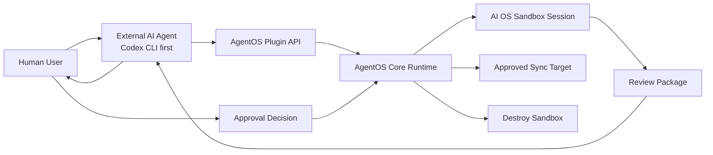
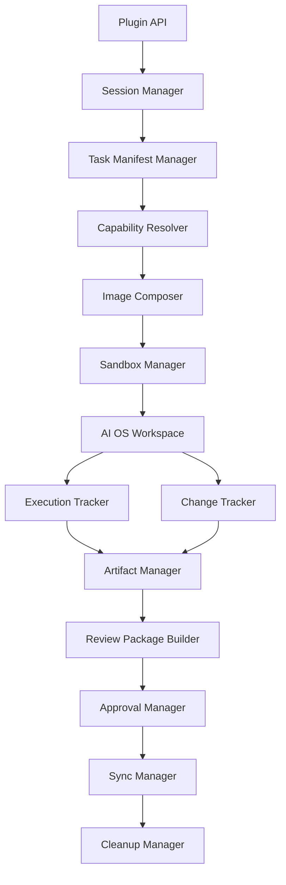
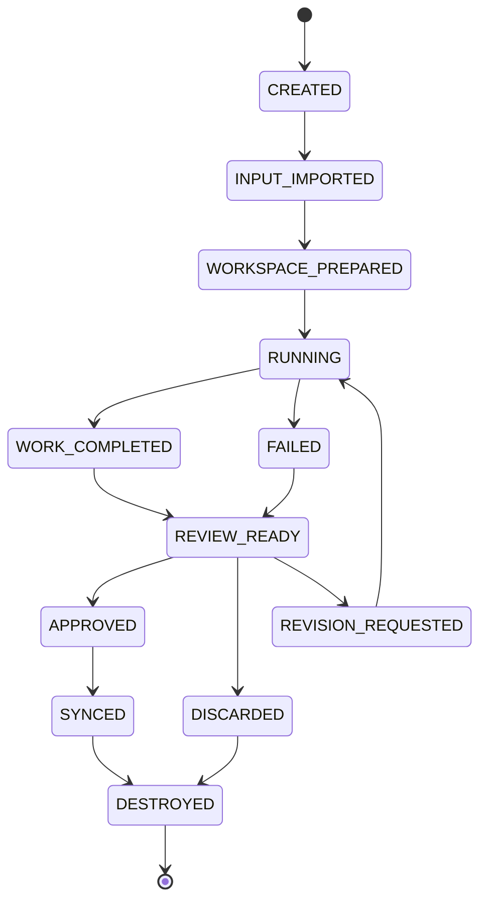
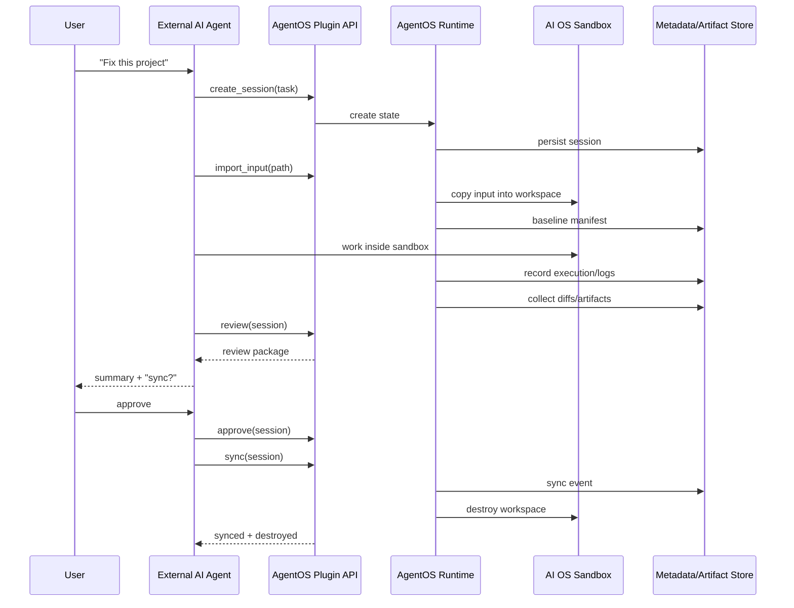
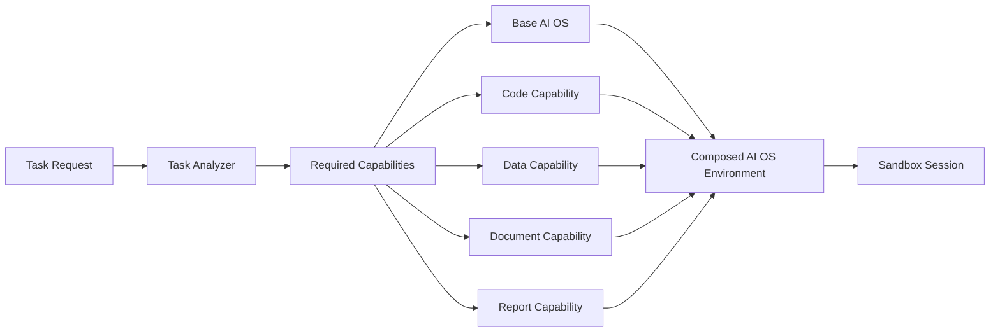
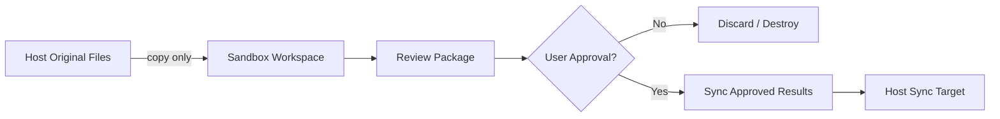
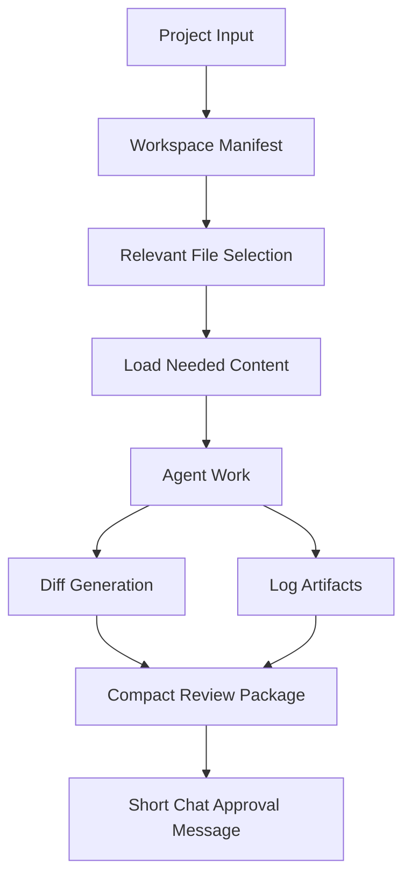

# AgentOS Diagrams v0.2

작성일: 2026-06-16

This document contains Mermaid diagrams for core AgentOS design.

## 1. System Context

## 2. Runtime Components

## 3. Session State Machine

## 4. Main Sequence

## 5. Capability Composition

## 6. Approval Boundary

## 7. Context Efficiency Flow

